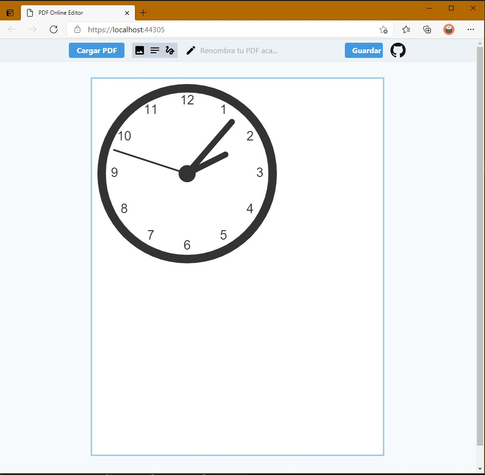
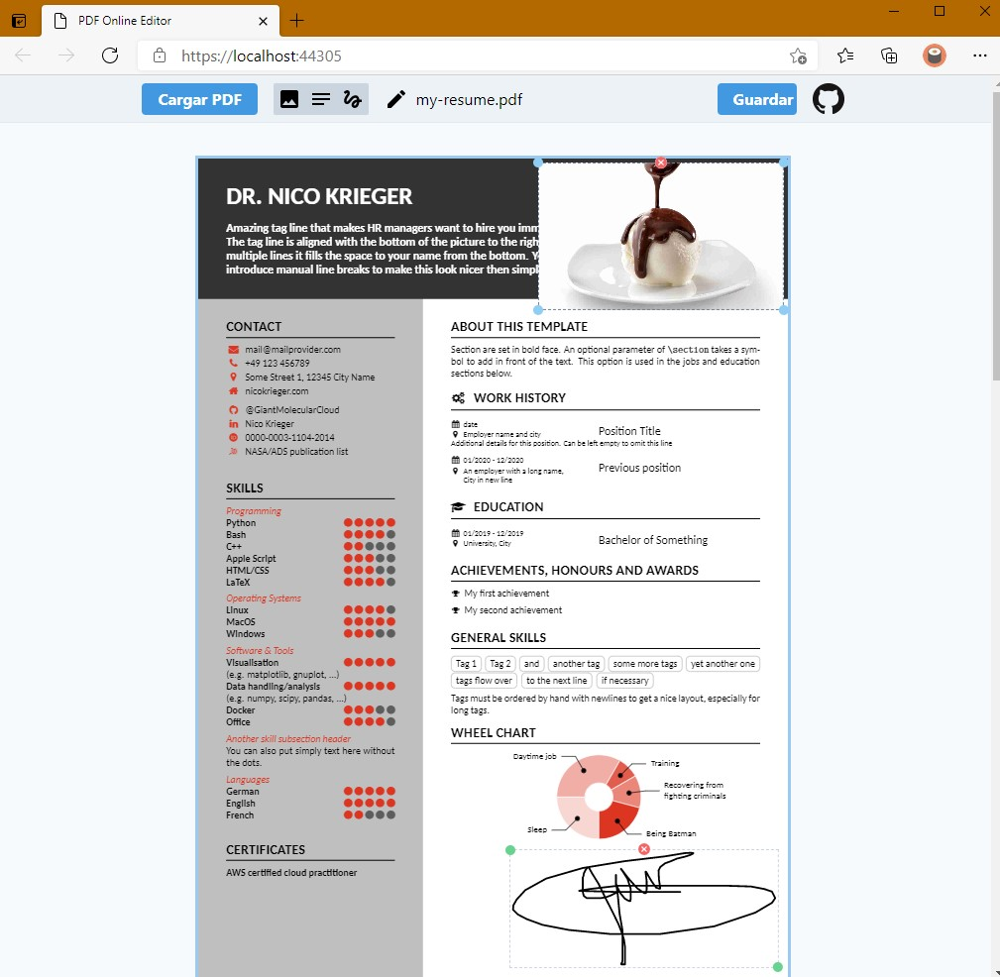
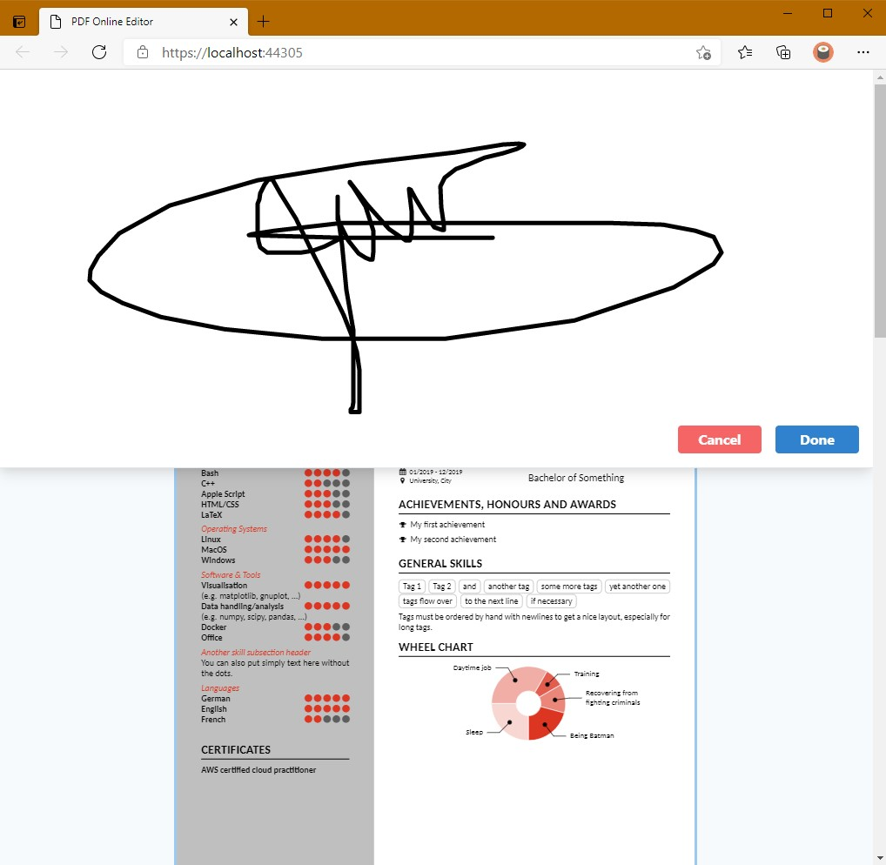

# PDF-OEditor.js

📑 HTML5 Javascript Online Offline Browser Editor 📜 for PDF files for insert sign, images, photos, comments or annotations.

I dont found a free or open source solution at 2021 for make annotations on PDF files on the browser,
for an Angular project, so, we need to build one with libraries and projects that i found.

Ranking of Open Source PDF Online Editors 2021-02-01: [OPEN-SOURCE-PDF-ONLINE-EDITORS.xlsx](docs/OPEN-SOURCE-PDF-ONLINE-EDITORS.xlsx)

 
 
 

## Technology and Frameworks Used

* Microsoft Asp.Net 5 Core
* Microsoft Internet Server IIS 10
* Microsoft Visual Studio 2019
* Javascript

## Libraries

* [PDF.js](https://mozilla.github.io/pdf.js/) A Mozilla general-purpose, web standards-based platform for parsing and rendering PDFs.
* [pdf-lib](https://pdf-lib.js.org/) Create and modify PDF documents in any JavaScript environment.
* [download.js](https://github.com/rndme/download) File downloading using client-side javascript

## Main Features

- [x] Load PDF file server side or client side.
- [x] **Save PDF file as original PDF, not as image (print or render), as many JS editor...**
- [x] Insert image.
- [x] Insert sign.
- [x] Insert annotation.

## Philosophy of Javier Cañon

* KISS by design and programming. An acronym for "keep it simple, stupid" or "keep it stupid simple", is a design principle. The KISS principle states that most systems work best if they are kept simple rather than made complicated; therefore, simplicity should be a key goal in design, and unnecessary complexity should be avoided. Variations on the phrase include: "Keep it simple, silly", "keep it short and simple", "keep it simple and straightforward", "keep it small and simple", or "keep it stupid simple".
* Select the best tools for the job, use tools that take less time to finish the job.
* Productivity over complexity and avoid unnecessary complexity for elegant or beauty code.
* Computers are machines, more powerful every year, give them hard work, concentrate on being productive.
* Often people, especially computer engineers, focus on the machines. They think, "By doing this, the machine will run fast. By doing this, the machine will run more effectively. By doing this, the machine will something, something, something..." They are focusing on machines. But in fact we need to focus on humans, on how humans care about doing programming or operating the application of the machines. We are the masters. They are the slaves. [Yukihiro Matsumoto].

## Supported by, thanks to 

 

[Softcanon](https://softcanon.com) 
-- 

## License

This project is licensed under the MIT LICENSE - see the [LICENSE.md](/LICENSE.md) file for details.

---
Made with ❤️ by **[Javier Cañon](https://javiercanon.com)**.
